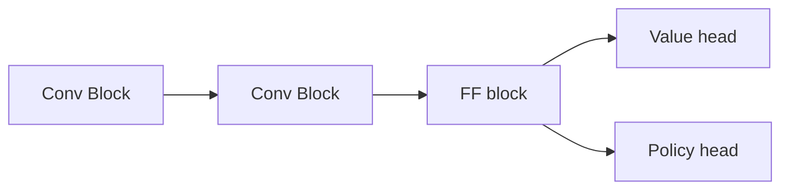

# Alpha Zero Connect 4 Python  

## Implementation details

### Network architecture

Where:

- `Conv Block`:
    - `Conv`: 4n in, 4xn out, 5x5 convolution with stride 1, padding 2
    - `Activation`: Selu
    - `MaxPool`: 2x2 max pooling
    - `Dropout`: 0.1
- `FF block`: `LazyLinear` with output 256, Selu activation and dropout
- `Value head`:
    - `Linear`: 256, 64 out
    - `Activation`: Selu
    - `Dropout`: 0.5
    - `Linear`: 64, 1 out
    - `Activation`: Tanh
- `Policy head`:
    - `Linear`: 256, 128 out
    - `Activation`: Selu
    - `Linear`: 128, 128 out
    - `Activation`: Selu 
    - `Linear`: 128, 64 out
    - `Activation`: Selu 
    - `Dropout`: 0.5
    - `Linear`: 64, 8 out

## Training Methodology

In order to train the model, the following sequence of steps is applied:
1. For each episode do the following:
    1. Create two agents, randomly choose one to start.
    2. Play the game until the game is over.
    3. Record the choices of each player.
    4. The winner will take positive score whereas the loser will take negative score. Draws result with score of 0.
2. Run around 50 episodes in parallel and record the results
3. Train the model on the recorded results
4. Repeat the process

## Commands

* To train the model: run the `trainer_main.py` file. If you want to use the recorded model, use the `load` option to load the saved model.
* To test the model in an actual main, use the normal main file. You can use the `load` to use the latest checkpoint of the model

## References

1. [AlphaZero paper](https://storage.googleapis.com/deepmind-media/DeepMind.com/Blog/alphazero-shedding-new-light-on-chess-shogi-and-go/alphazero_preprint.pdf)
2. [Simplified implementation](https://joshvarty.github.io/AlphaZero/)

